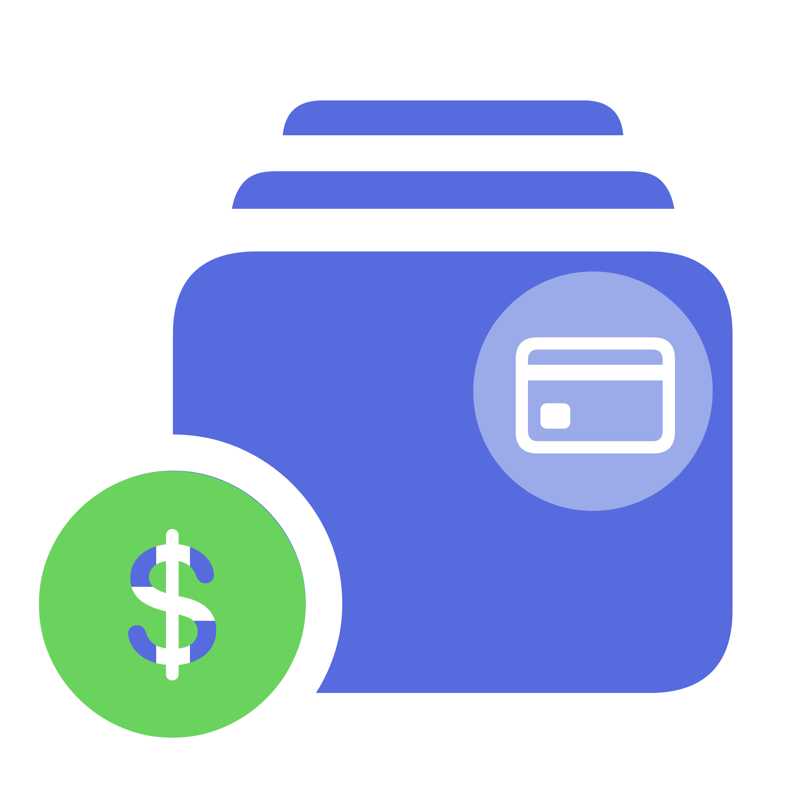


 [](https://hits.seeyoufarm.com)

# Sub Track: A Subscription Tracker Application built using Flutter

### Sub Track is first open source Subscription Tracker app made using Flutter

### Want to Contribute?

Refer [CONTRIBUTING.md](CONTRIBUTING.md)
# TODO
### &emsp; Prority
- [ ] Add Notifications
- [ ] Arrange Ongoing Subs according to Date
- [ ] Add Currency Selection Screen
- [ ] Add Android Specific UI for select icon view
- [ ] Enable Emoji selection in select icon view

### &emsp; Just Feature
- [x] Firebase Sync
- [x] History
- [ ] Archive Subscription
- [ ] Pause Subscription
- [x] Add Shared with
- [x] Show Remaining days

### Screenshots

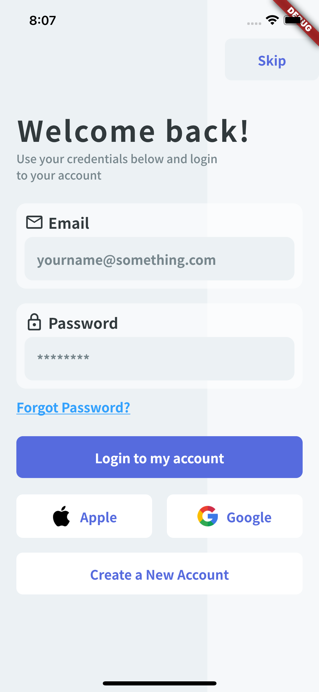
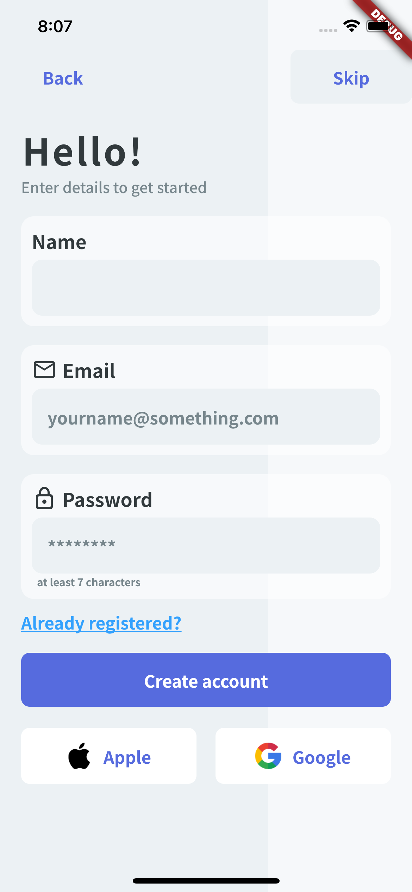
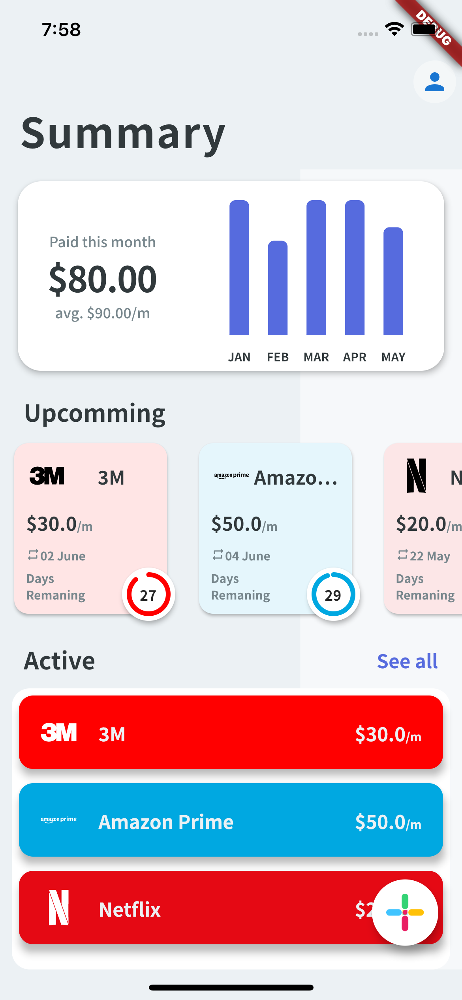
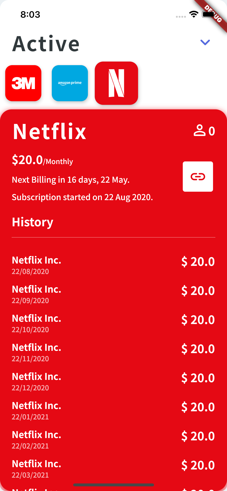
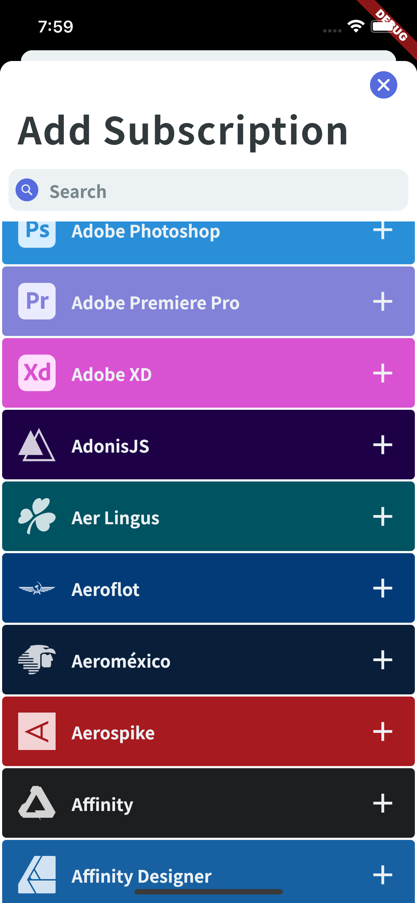
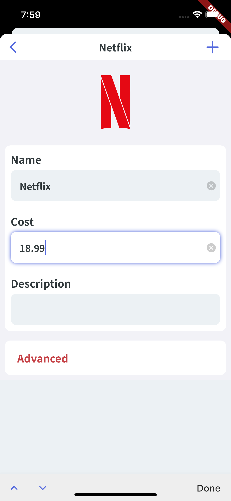
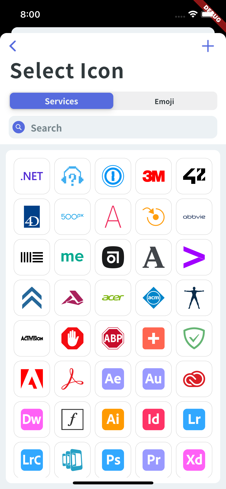
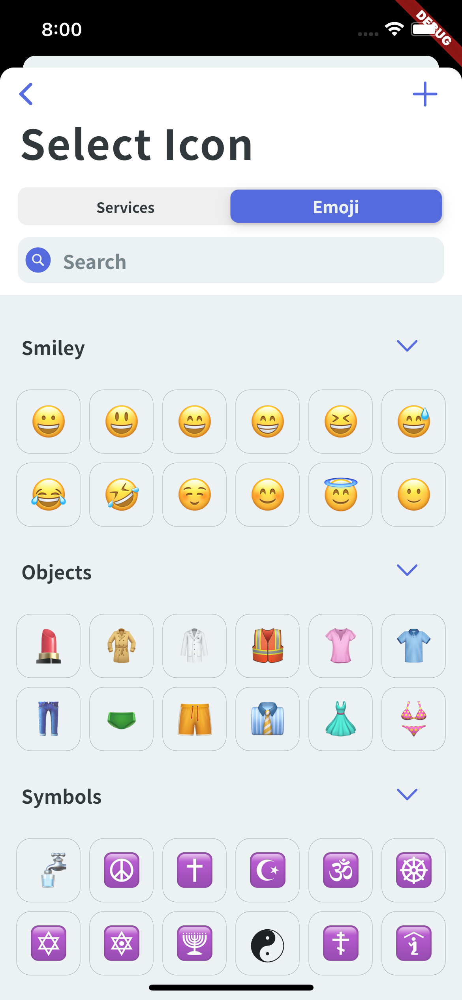
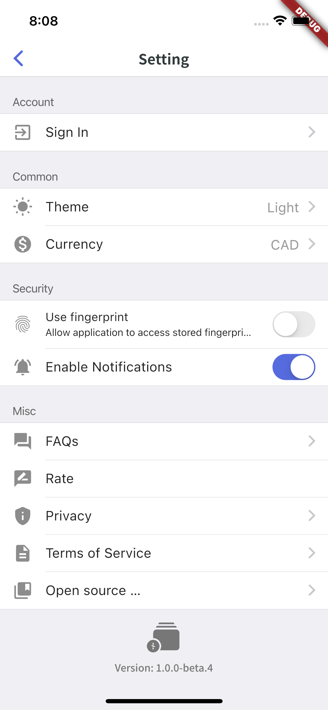

### And More...

# Setup

# Project Quick Info

- This Project uses `Hive` for local storage and `Firebase Firestore` for remote storage
- MVVM Pattern
- App Architecture (This is the simplest way I came up):
    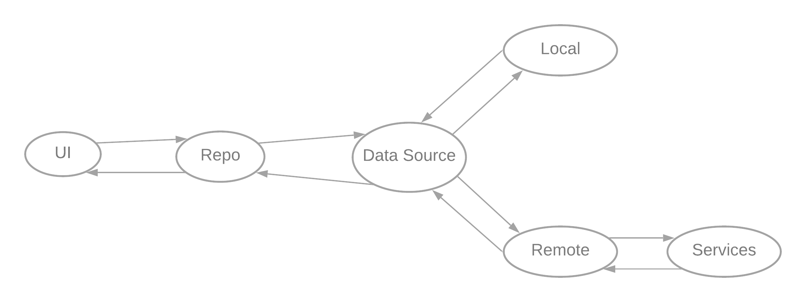
# Project Structure

This is a Flutter mobile app targeting Android and iOS.

The code for the Flutter app is contained in the folder `lib` and the
different native apps are in `android` and `ios`. Extra project assets are in
`assets` and `fonts`.


# Prerequisites & Getting Started

## Client 

To build and run the mobile apps you’ll need to install [Flutter](https://flutter.dev) and its dependencies. To verify your installation run in the project’s root directory:**‌**

```
$ flutter doctor
```

The app is optimised for Android and iOS phones in portrait mode.

**Note:** The project should support most recent Flutter version.

**Note:** Additionally you’ll need to setup the backend and add the GoogleService-Info of your Firebase app to your clients as described below.

## Backend (Firebase)

*Note: The following steps assume you’re using Firebases’ free `Spark Plan`. Therefore we’re performing the configuration manually.*

### 1. Setup sign-in methods

An initial sign-in method needs to be configured.

- Select your project in [console.firebase.google.com](https://console.firebase.google.com). 
- Navigate to `Authentication` 
- Select `Sign-in methods` and activate `Email / Password`, `Google`, `Apple` and `Anonymous`.

### 2. Configure firebase app

Next, you’ll need to configure your firebase app for Flutter as described in [Add Firebase to an App / Flutter](https://firebase.google.com/docs/flutter/setup)

**iOS**

- Enter iOS-Bundle-ID: `com.yourname.subTrack` or anything else
- Download `GoogleService-Info.plist`.
- Copy file to `ios/Runner/Firebase`.

**Android**

## Setting up Firebase

Create a project on the Firebase console [here](https://console.firebase.google.com/)

1. To add Firebase to your app, click on the android icon or click the gear icon to go to project
settings to find the android icon.

2. Register your application by filing up the form with the package name (applicationId) 
and the app nickname if you like.
> Find Your package name which is generally the applicationId in your app-level build.gradle file

3. Download the `google-service.json` file that is generated for you. Find it and move it inside
the folder `android/app/` of the project. The firebase sdk is already added to the project.

4. On the fourth step of registration, run the app to verify the configuration via the Firebase
console.

## Distribution

To build this application for distribution, 
provide a file `key.jks` containing the signing keys, 
and the `key.properties` with the following content:

```
storePassword=.....
keyPassword=.....
keyAlias=key
storeFile=../key.jks
```

Where you set the `storePassword` and the `keyPassword`. You can also change the alias.

You will need to uncomment the section `signingConfigs` in the `app/build.gradle`.

And change the `signingConfig signingConfigs.debug` to `signingConfig signingConfigs.release`.

You can also provide this files from your CI instead of including this in the project.

**Note:**

`CI/CD` using GitHub Actions is already configured in [`actions/ci_cd_android`](https://github.com/ketanchoyal/Sub-Track/tree/actions/ci_cd_android) branch.

**CI/CD**

In branch [`actions/ci_cd_android`](https://github.com/ketanchoyal/Sub-Track/tree/actions/ci_cd_android), auto publishing of apk for testers using firebase distribution is configuted.

Everytime a new tag is created in that branch apk is built and is sent to all the testers.

A Similar setup can be configured for iOS but it requires developer account and ips with Ad Hoc Profile

# About

A Native iOS Version using SwiftUI is on the way

I hope this project can be a reference or building block for your next flutter app. 🚀
